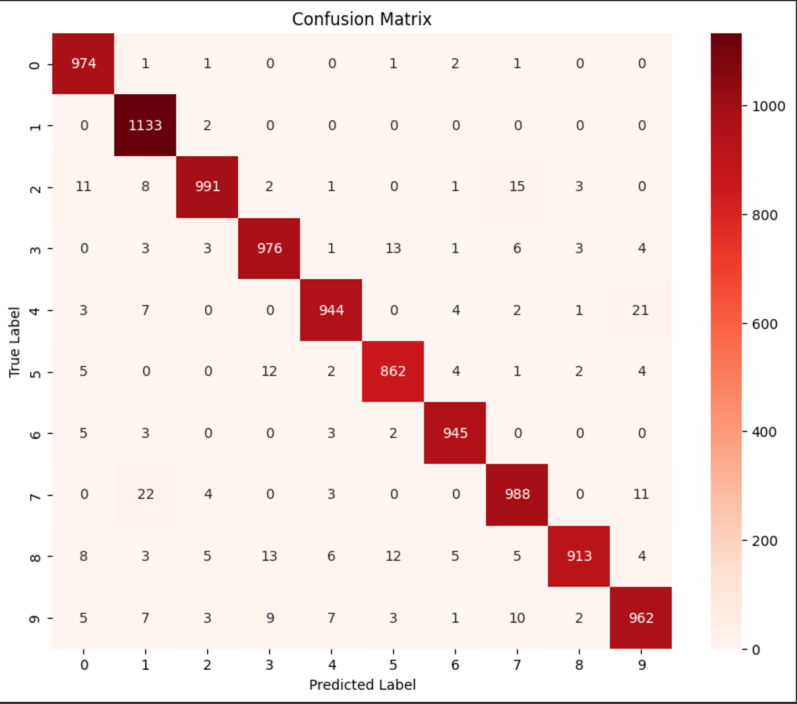
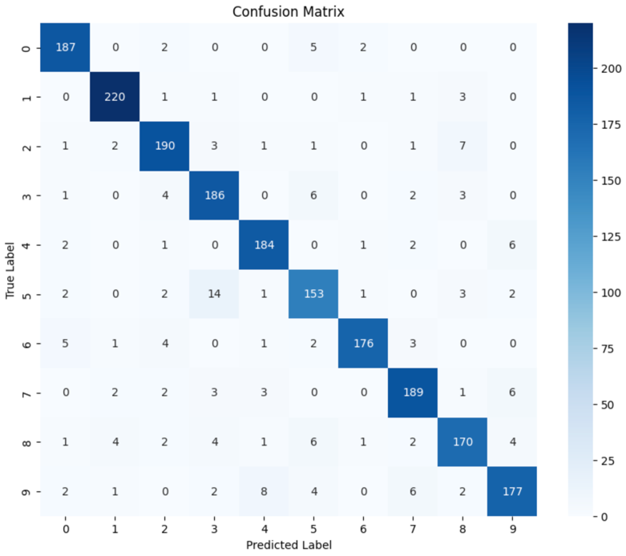
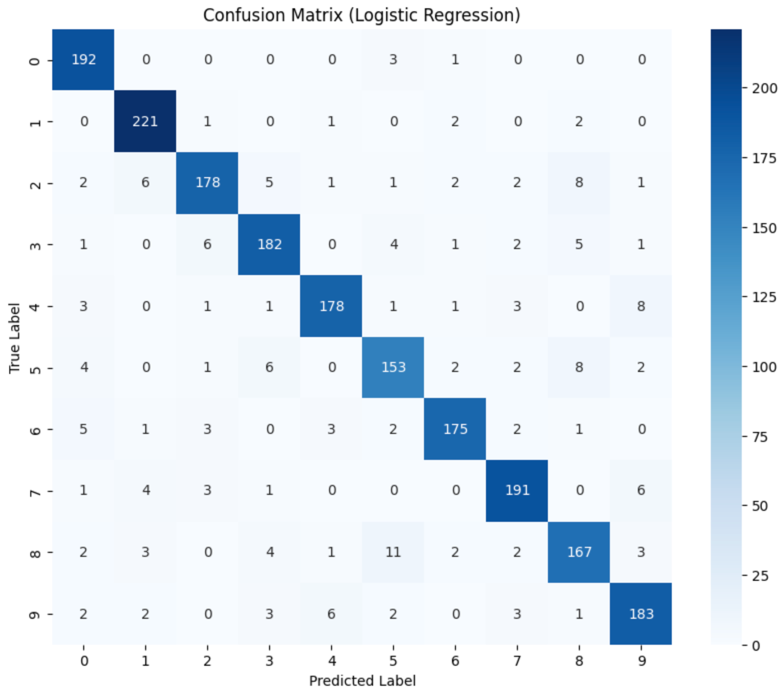
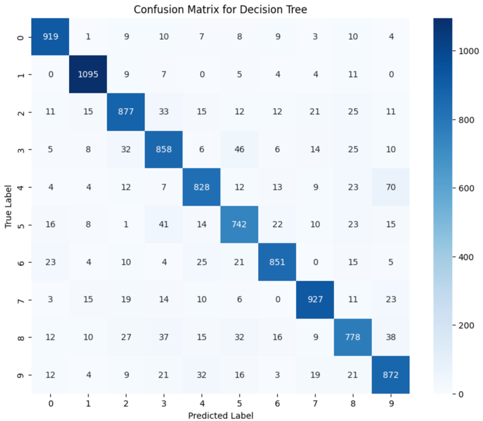
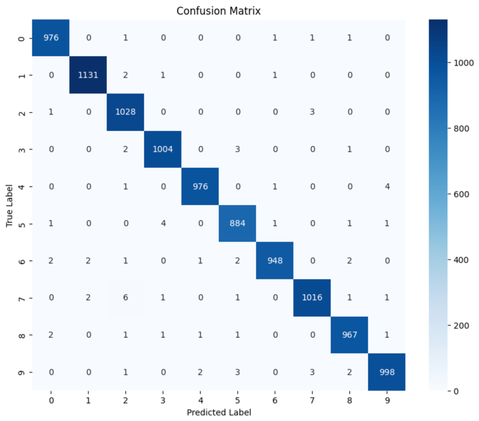

# Handwritten Digit Classification

# Problem Statement
To classify images of handwritten digits present in the [MNIST dataset](https://www.tensorflow.org/datasets/catalog/mnist) using various models like K Nearest Neighbour, Support Vector Machine, Logistic Regression, Convolutional Neural Network, etc.

# Setup
* Dataset used: [MNIST dataset](https://www.tensorflow.org/datasets/catalog/mnist)
* No. of training samples = 60000
* No. of test samples = 10000

# Results
## K-Nearest Neighbour (KNN)

Test Accuracy: 96.88%

## Support Vector Machine (SVM)

Test Accuracy: 91.60%

## Logistic Regression

Test Accuracy: 91.00 %

## Decision Tree

Test Accuracy: 87.47 %

## Convolution Neural Network

Test Accuracy: 99.28 %

